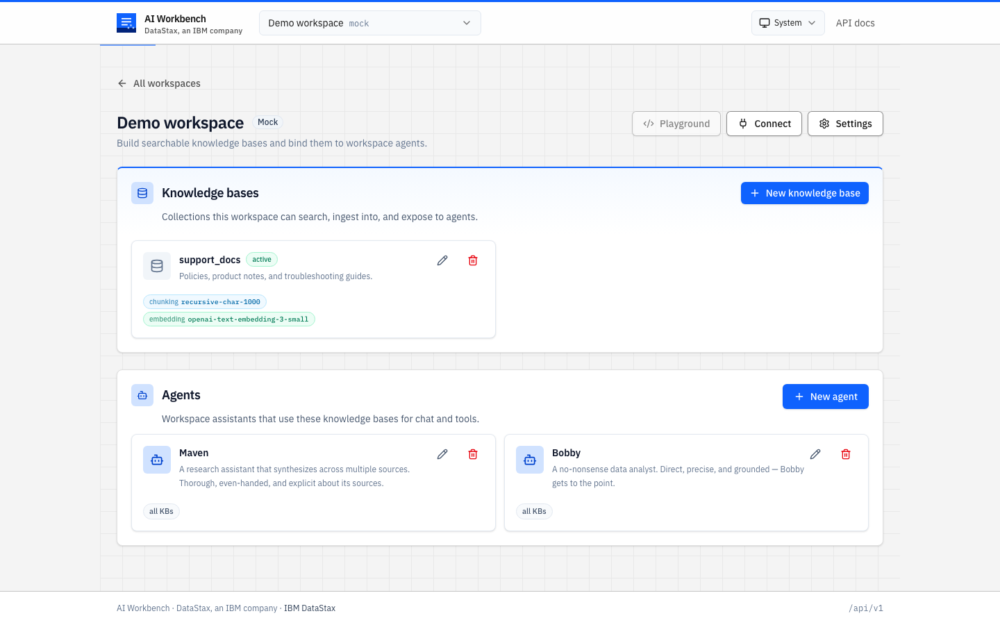
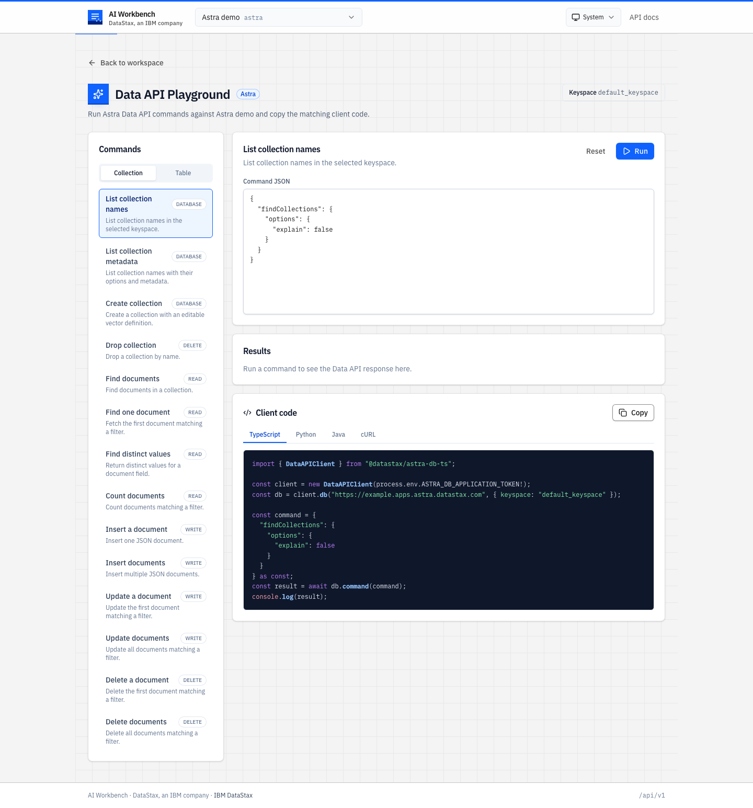

# AI Workbench

[](https://github.com/datastax/ai-workbench/actions/workflows/ci.yml)
[](https://github.com/datastax/ai-workbench/actions/workflows/runtimes.yml)
[](https://github.com/datastax/ai-workbench/actions/workflows/secret-scan.yml)
[](./.nvmrc)
[](./LICENSE)

AI Workbench is a self-hosted app for building and operating
retrieval-backed AI applications on DataStax Astra. It gives you a
single place to create workspaces, organize knowledge bases, configure
agents, manage service settings, issue workspace API keys, and try Astra
Data API commands from the browser.



## What You Can Do

- **Create workspaces** for Astra databases, local mock backends, and
  future backend kinds.
- **Build knowledge bases** that own their collections, ingest files,
  and bind to chunking, embedding, and reranking services.
- **Configure agents** with personas, retrieval defaults, and LLM
  service bindings.
- **Use the Playground** to run Data API collection and table commands,
  inspect results, and copy equivalent TypeScript, Python, Java, or
  cURL examples.
- **Expose workspace context** through API keys, the HTTP API, and the
  optional MCP surface.

## Run Locally

### Prerequisites

- Node.js 22+
- npm
- Optional: an Astra account and the `astra` CLI if you want the app to
  discover your database defaults automatically

### Start The App

```bash
npm run setup
npm start
```

Then open [http://localhost:8080](http://localhost:8080).

`npm start` builds the web UI and starts the default TypeScript runtime.
One process serves:

- the app at `/`
- the JSON API at `/api/v1/*`
- the API reference at `/docs`

For UI development with live reload, use two terminals:

```bash
npm run dev
npm run dev:web
```

The Vite app runs on [http://localhost:5173](http://localhost:5173) and
proxies API calls to the runtime on `:8080`.

## First Tour

1. **Create or select a workspace.** Astra workspaces can use explicit
   endpoint/token references, or values discovered from the `astra` CLI.
2. **Add a knowledge base.** Bind it to the workspace's chunking and
   embedding services, then ingest files from the knowledge-base page.
3. **Create agents.** Start from the default templates or create your
   own persona, then chat against the workspace's knowledge.
4. **Open Playground.** For Astra workspaces, choose `Collection` or
   `Table`, select a command, edit the request JSON, run it, and copy
   client code.
5. **Tune settings.** Services, LLM providers, credentials, and API keys
   live in workspace settings so the main workspace page stays focused.



## Useful Commands

| Command | Purpose |
|---|---|
| `npm run setup` | Install root, TypeScript runtime, and web UI dependencies. |
| `npm start` | Build the UI and start the runtime on `:8080`. |
| `npm run dev` | Start the API/runtime only, in watch mode. |
| `npm run dev:web` | Start the Vite UI on `:5173` with API proxying. |
| `npm run check` | Run linting, typechecks, tests, and build gates. |
| `npm run test:web` | Run the web UI test suite. |
| `npm test` | Run the TypeScript runtime tests. |

## Configuration

The default dev config lives at
[`runtimes/typescript/examples/workbench.yaml`](runtimes/typescript/examples/workbench.yaml).
At startup the runtime chooses a control-plane backend:

- Astra Data API tables when Astra endpoint and token values are
  available, including values discovered from `astra` CLI profiles
- local file storage when Astra credentials are not available
- in-memory storage when explicitly configured for tests or throwaway
  demos

See [`docs/configuration.md`](docs/configuration.md) for the full
`workbench.yaml` reference, [`docs/astra-cli.md`](docs/astra-cli.md) for
CLI discovery, and [`docs/production.md`](docs/production.md) before
exposing a runtime beyond localhost.

## Technical Notes

The app is designed to be usable first and inspectable second. The
details below are here when you need to understand or extend the system.

<details>
<summary>Runtime model</summary>

The TypeScript runtime is the production path today. It serves the UI,
implements the full `/api/v1/*` contract, and is the runtime bundled
into the Docker image.

Python and Java runtimes live under [`runtimes/`](runtimes/) as preview
green-box scaffolds. They boot, expose operational endpoints, and return
HTTP 501 for versioned API routes until their handlers reach parity.
The shared conformance harness keeps the contract testable across
language implementations.

</details>

<details>
<summary>Architecture</summary>

```text
Workbench UI
  |
  | BACKEND_URL
  v
TypeScript runtime
  |
  | /api/v1/*
  v
Control plane
  |-- memory, file, or Astra Data API tables
  |
  v
Data plane
  |-- Astra collections owned by knowledge bases
  |-- Astra tables and collections addressed by Playground commands
```

For the full model, see [`docs/architecture.md`](docs/architecture.md).

</details>

<details>
<summary>Project layout</summary>

```text
ai-workbench/
├── apps/web/                 # Vite + React UI
├── runtimes/
│   ├── typescript/           # Default production runtime
│   ├── python/               # FastAPI preview runtime
│   └── java/                 # Spring Boot preview runtime
├── conformance/              # Cross-runtime contract harness
├── docs/                     # Product, architecture, and ops docs
├── package.json              # Root orchestration scripts
└── biome.json                # Shared lint/format config
```

</details>

## Documentation

| Document | Start here when you need... |
|---|---|
| [`docs/overview.md`](docs/overview.md) | A product-level walkthrough. |
| [`docs/workspaces.md`](docs/workspaces.md) | Workspace semantics, scoping, and cascade behavior. |
| [`docs/agents.md`](docs/agents.md) | Agent personas, RAG defaults, LLM bindings, and chat routes. |
| [`docs/playground.md`](docs/playground.md) | Playground workflow and UX notes. |
| [`docs/mcp.md`](docs/mcp.md) | The MCP facade for external agents. |
| [`docs/configuration.md`](docs/configuration.md) | `workbench.yaml` configuration details. |
| [`docs/auth.md`](docs/auth.md) | API keys, OIDC, sessions, and auth rollout notes. |
| [`docs/api-spec.md`](docs/api-spec.md) | HTTP API contract narrative. |
| [`docs/conformance.md`](docs/conformance.md) | Cross-runtime contract testing. |
| [`runtimes/README.md`](runtimes/README.md) | Runtime status by language. |
| [`apps/web/README.md`](apps/web/README.md) | Web UI development details. |

The generated API reference is also available from a running app at
[`/docs`](http://localhost:8080/docs), with the machine-readable OpenAPI
document at `/api/v1/openapi.json`.

## Contributing

Setup notes, PR expectations, and contract-change rules live in
[`CONTRIBUTING.md`](CONTRIBUTING.md). Security issues use the private
channel described in [`SECURITY.md`](SECURITY.md).

## License

MIT. See [`LICENSE`](LICENSE).
